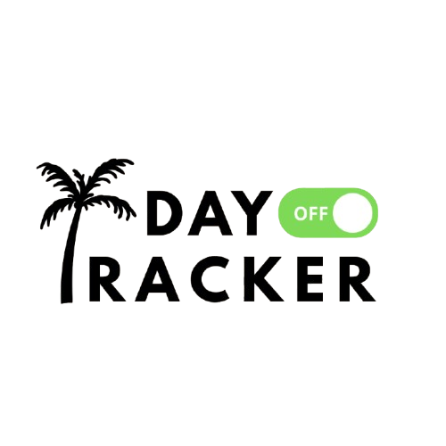

  <h1>Day Off Tracker</h1>
  
  

---

## Sobre o Projeto

O **Day Off Tracker** é uma aplicação web intuitiva e responsiva projetada para ajudar no planejamento, gestão e acompanhamento de dias de folga e escalas de descanso. 

Criado com uma interface minimalista e direta (estilo *glassmorphism*), o sistema funciona como um "toggle switch" visual para a sua rotina: quando o modo folga está ativado, é hora de desconectar!

---

## Funcionalidades Prontas

* **Cálculo de Escala Automático:** Descubra suas próximas folgas de forma precisa a partir da sua última data de descanso.
* **Filtro Inteligente:** A lista lateral exibe apenas as folgas do mês atual que ainda vão acontecer.
* **Calendário Interativo:** Visualização limpa e integrada dos dias de descanso usando a biblioteca *FullCalendar*.
* **Persistência de Dados:** Suas datas continuam salvas no navegador mesmo se você fechar ou atualizar a página.
* **100% Responsivo:** O layout se adapta perfeitamente para uso em smartphones ou tablets.

---

## Tecnologias Utilizadas

* **Front-end:** HTML5, CSS3 (com variáveis modernas e Media Queries)
* **Lógica:** JavaScript Assíncrono (ES6)
* **Bibliotecas:** [FullCalendar v6](https://fullcalendar.io/) (para renderização do calendário mensal)

